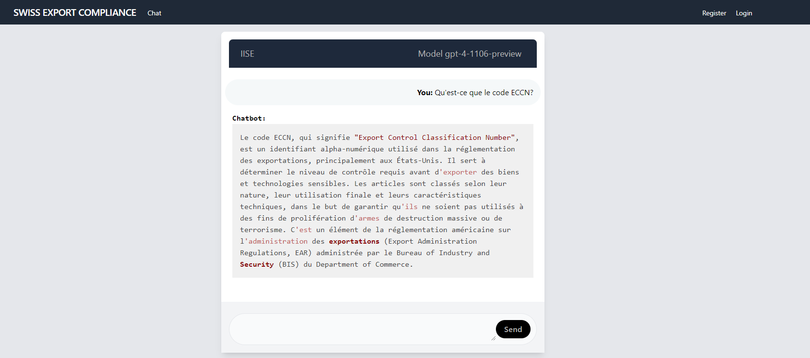

<span id="readme-top"></span>

<div align="center">

<h3 align="center">IISE (Intelligent Internal Search Engine)</h3>

  <p align="center">
      This project aims to develop a chatbot specialized in the field of export and import compliance. Equipped to assist users by answering their questions via a chatbot. To achieve this, the chatbot exploits advanced natural language processing technologies provided by OpenAI, in particular the GPT-4 Model, enabling accurate understanding and response to user queries.
    <br />    <br />
    </p>
</div>

## Getting Started

### Prerequisites

- Python 3.10
- Miniforge

### Installation

Clone this repository to your local machine:

1. Clone the repo

   ```sh
   git clone https://github.com/ricelq/pr_chatbot_python_openai.git
   ```

2. Creates a new conda environment
   <br>

   ```sh
   conda env create -f env.yaml
   ```

3. Run application

   ```sh
   python run.py

   ```

## Enabled Packages

| Concern   | Bundles                                                                    |
| --------- | -------------------------------------------------------------------------- |
| Python    | [`Python 3.10.14`](https://www.python.org/downloads/release/python-31014/) |
| Miniforge | [`miniforge`](https://github.com/conda-forge/miniforge)                    |

## Screenshots





## Contact

Ricel Quispe - [@linkedin](https://www.linkedin.com/in/ricelquispe) - ricel@prodeimat.ch

Project Link: [https://github.com/ricelq/pr_chatbot_python_openai](https://github.com/ricelq/pr_chatbot_python_openai)

<p align="right">(<a href="#readme-top">back to top</a>)</p>
